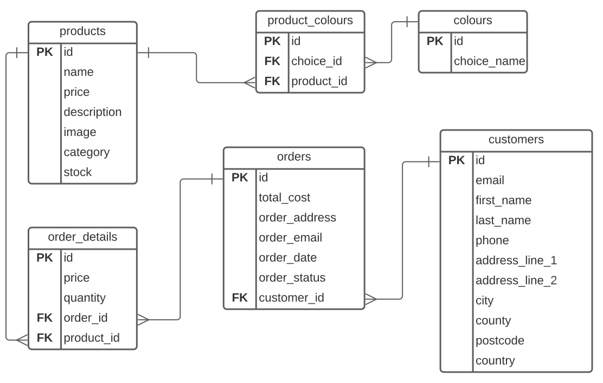

# Database Documentation

## Introduction

- The database is hosted locally. It is a PostgreSQL database.

- It stores products, their information including, category, colour, price, stock and name.

- User details are also stored in the database.

- Orders made by users are also stored in the database.

## Interaction with the database

I have used the [node-postgres](https://node-postgres.com/)(node-postgres, n.d.)  module to interact with the database.

The module allowed me to connect to the database and perform CRUD operations. I used the following commands to connect to the database:

```js
const { Pool } = require('pg');
const pool = new Pool({
  user: 'postgres',
  host: 'localhost',
  database: 'block_shop',
  password: 'password',
  port: 5432,
});
pool.connect();
```

I then used the commands similar to below to perform CRUD operations:

```js
Pool.query('SELECT * FROM products')
  .then(res => console.log(res.rows))
  .catch(e => console.error(e.stack));

Pool.query("INSERT INTO products (category, colour, price, stock, name) VALUES ('category', 'colour', 'price', 'stock', 'name')")
  .then(res => console.log(res.rows))
  .catch(e => console.error(e.stack));

Pool.query("UPDATE products SET category = 'category', colour = 'colour', price = 'price', stock = 'stock', name = 'name' WHERE id = 'id'")
  .then(res => console.log(res.rows))
  .catch(e => console.error(e.stack));

Pool.query("DELETE FROM products WHERE id = 'id'")
  .then(res => console.log(res.rows))
  .catch(e => console.error(e.stack));
```

Promises were used to handle queries, ensuring that the code was executed in the correct order. Using promises allowed me to wait for the database to return a result before executing the next query/process.

## Entity Relationship Diagram
